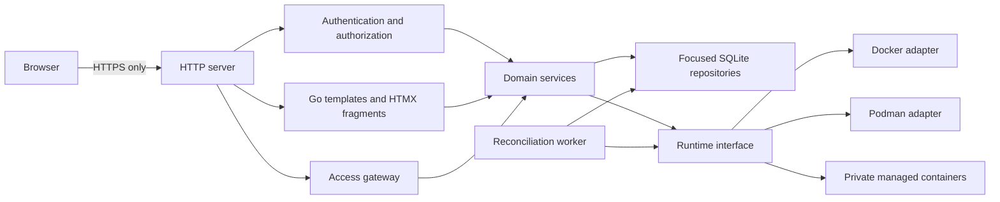

# COWS Architecture

## Shape

COWS starts as a modular monolith. One process contains the HTTP service,
server-rendered web interface, domain services, SQLite repositories, runtime
adapter, and reconciliation worker. Internal interfaces mark boundaries that
may later become a privileged host agent or another deployable component, but
there is no distributed system in the first milestone.



## Security boundaries

The public boundary is the COWS HTTPS endpoint. The browser supplies user
intent, not a container ID, backend address, port, image, or runtime argument.
Handlers authenticate the request and authorize the concrete operation before
calling a domain service. Domain services repeat ownership and policy checks
so a future handler cannot accidentally create a bypass.

The runtime adapter is the only application boundary allowed to communicate
with Docker or Podman. The runtime socket should be available only to the COWS
process, or later to a narrowly privileged host agent. Containers use private
networking where practical; no workspace port is a public routing mechanism.

Terminal, desktop, and proxy sessions are authenticated COWS sessions whose
targets are selected from server-side workspace records and template policy.
They are not generic reverse proxies.

## Request and state flow


Desired and observed state are separate fields. A runtime restart, manual
deletion, partial failure, or COWS restart must not be hidden by treating the
database as proof that a container exists. Reconciliation periodically lists
managed runtime objects, matches them using COWS labels, updates observed
state, records anomalies, and applies a documented policy to orphaned or
missing objects. Lifecycle operations should be idempotent where the runtime
allows it.

## Packages and ownership

The initial package layout stays small:

```text
cmd/cows/              process startup, bootstrap, and graceful shutdown
internal/config/       configuration parsing and validation
internal/database/     SQLite setup and migrations
internal/web/          handlers, templates, and static asset serving
internal/domain/       stable COWS concepts and error categories
internal/auth/         password authentication and session use cases
internal/repository/   focused persistence interfaces and SQLite implementation
internal/runtime/      Docker and Podman domain adapter boundary
internal/runtime/docker/ read-only Docker Engine API adapter
migrations/            ordered SQL migrations
web/                   templates and local browser assets
docs/decisions/        short architecture decisions
```

Packages should be created when they contain meaningful code. Avoid a broad
generic database wrapper and avoid leaking Docker-specific types into domain or
HTTP packages.

## Database direction

SQLite uses WAL mode, foreign keys, a busy timeout, application-controlled
migrations, and a local supported filesystem. The first schema migration only
proves the migration mechanism. The later control-plane schema is expected to
contain users, roles, templates, template access rules, workspaces, desired and
observed state, quota assignments, runtime identifiers, access sessions, policy
configuration, hosts, and structured audit events.

Repository methods should represent domain operations rather than expose SQL
details. PostgreSQL is a future option when multiple active control-plane
instances or higher availability requirements justify it.

Workspace templates are administrator-controlled records. Their current policy
surface contains an image reference and optional immutable digest, CPU/memory/
storage defaults and maxima, supported access-method names, allowed roles, and
enabled state. JSON columns store the small access-method and role lists for the
initial SQLite deployment; browser input is converted to typed values and
validated before persistence. Runtime arguments, mounts, capabilities, devices,
host networking, and arbitrary environment values are intentionally absent.

Workspaces reference an owner and template through foreign keys. Creation
stores the template's default allocations and desired state `stopped`; it does
not contact Docker. Observed state, runtime ID, and reconciliation errors are
stored separately and may only be updated by reconciliation code. Ordinary
users can list and access their own records; administrators can inspect all
records through service-layer authorization.

## Frontend architecture

Go `html/template` renders complete pages, layouts, components, and fragments.
HTMX submits forms and replaces server-rendered fragments. Alpine.js is limited
to ephemeral browser-local state such as dialogs or tabs; it is never the source
of authoritative workspace state. Browser libraries are pinned, stored locally,
and served from COWS. There is no Node.js, npm, TypeScript, bundler, or required
frontend compilation step.

HTMX and Alpine.js are the only browser dependencies in the foundation. Web
Awesome is the preferred candidate for a later standards-based component
library, but it is not added until its self-hosted distribution, licensing, and
update procedure are verified against the repository policy. The initial page
uses semantic HTML and a small project stylesheet so the library decision does
not become an unreviewed runtime dependency.

## Future host-agent boundary

The runtime interface is intentionally internal and domain-oriented. The
interface-only preparation currently lives in `internal/runtime`; it performs
no lifecycle operations. The current Docker adapter performs only read-only
version, host-capacity, managed-list, and inspect requests. A future host agent
may own runtime socket access, host
registration, capability reporting, and remote lifecycle operations. That is an
evolution point, not a reason to add RPC, a message broker, or multiple services
now.

## Operational direction

Use structured `log/slog` logging with request correlation IDs and safe context.
Expose a health endpoint in Milestone 0. Later readiness should include database
and runtime connectivity, and metrics should be sampled in memory or delegated
to a monitoring system rather than written on every sample to SQLite.
