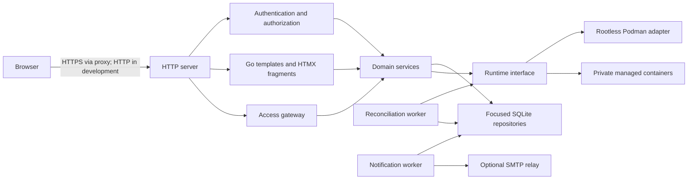
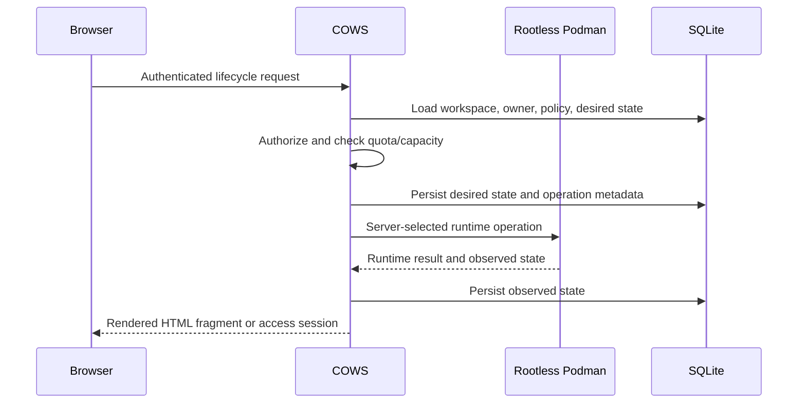

# COWS Architecture

## Shape

COWS starts as a modular monolith. One process contains the HTTP service,
server-rendered web interface, domain services, SQLite repositories, runtime
adapter, and reconciliation worker. Internal interfaces mark boundaries that
may later become a privileged host agent or another deployable component, but
there is no distributed system in the first milestone.



## Security boundaries

The public boundary is the COWS HTTP service, normally placed behind a reverse
proxy that provides HTTPS. The browser supplies user
intent, not a container ID, backend address, port, image, or runtime argument.
Handlers authenticate the request and authorize the concrete operation before
calling a domain service. Domain services repeat ownership and policy checks
so a future handler cannot accidentally create a bypass.

The runtime adapter is the only application boundary allowed to communicate
with rootless Podman. The user service socket should be available only to the COWS
process, or later to a narrowly privileged host agent. Templates without
the desktop service use `none` networking. Desktop-enabled templates use
loopback-only host mappings. Optional isolation gives new desktop-enabled
workspaces server-generated internal Podman networks; existing workspaces are
not migrated and host-level egress policy remains future work.
The optional image-management capability can inspect the local image store and
stream an explicitly requested template image pull. It is administrator-only;
workspace creation and startup never pull images implicitly.

The application is prepared for HTTPS termination by a reverse proxy. The
repository's Caddy example keeps COWS on loopback, enables secure cookies, and
passes WebSocket upgrades for terminal and desktop access. The development
process intentionally continues to serve plain HTTP; HSTS is added only by the
TLS proxy.

## Template runtime configuration

Templates contain a validated, administrator-controlled configuration document
for command, environment, managed mounts, and the dedicated desktop service.
The backend
snapshots this document into each workspace and resolves a small allowlist of
COWS placeholders only after authorizing the request and allocating resources.
Users submit neither runtime arguments nor rendered values. The desktop service
host port is reserved in SQLite with uniqueness constraints from an
administrator-defined range and is bound to loopback by the Podman adapter. No
other template service is accepted and no container service is made public.

The configuration is intentionally not a generic runtime argument map. The
resolver rejects unknown placeholders, duplicate names, invalid paths, unsafe
environment names, and dangerous runtime configuration. Managed mounts become
named volumes or bind mounts derived from the COWS workspace ID. Directory
mounts are created below the configured COWS mount root with names of the form
`cows-<workspace-id>-<prefix><mount-name><suffix>`. Templates can mark a
directory or named-volume mount read-only or read-write for the browser file
manager. Users cannot choose arbitrary host paths or rendered runtime
arguments.

Template images are checked against the local rootless Podman image store by
their exact reference and optional digest. The administrator template list
marks missing images and offers an explicit pull action. Pull progress is an
in-memory operation displayed through HTMX polling. A process restart loses
only the progress display; the image store remains authoritative. Registry
credentials, image update policies, and image garbage collection are deferred.

Templates may opt into a typed `container_user` block. COWS uses the existing
application username as the default container username and resolves the
administrator-controlled UID, GID, display name, home, and shell into a
passwd entry. Users cannot change these values when creating a workspace.
Rootless Podman receives a controlled UID:GID selection. It uses the
Libpod create API for the additional passwd entry and sends explicit UID/GID
mappings derived from Podman's subordinate-ID map. The mapping deliberately
leaves the COWS host account outside the container and maps container
identities into subordinate IDs. Writable bind mounts ask Podman to prepare
ownership for the selected container identity. The Podman adapter owns that
runtime-specific operation.

Terminal, desktop, and file-manager sessions are authenticated COWS sessions whose
targets are selected from server-side workspace records and template policy.
They are not generic reverse-proxy sessions.

The terminal gateway is the first implemented access gateway. After checking
the session, workspace ownership or administrator permission, observed running
state, and the template's terminal access method, it resolves the configured
container-user shell from the workspace template snapshot and asks the runtime
adapter for that fixed shell with the `-l` argument. Templates without a
container-user override use `/bin/sh`. A template may additionally provide a
typed `terminal_uids` allowlist. The terminal selector exposes only those UIDs,
and the backend checks the selected value again before asking Podman to execute
the shell as that container UID. UID 0 is an explicit administrator decision
and is warned about in the template editor. The browser receives only terminal
input and output over a COWS WebSocket; it never supplies a runtime ID or
command.
Terminal sessions have a 15-minute idle timeout, a one-hour maximum lifetime,
resize forwarding, and start/end audit events. The Podman adapter
uses the runtime exec API's upgraded stream and keeps the runtime-specific
transport details inside the adapter. Closing a terminal first inspects the
COWS-owned exec and terminates its process group through a short-lived
server-created cleanup exec while the upgraded stream is still attached; only
then is the transport closed. This ordering prevents a disconnected browser
from leaving an interactive shell running. The browser uses the locally vendored
xterm.js fit addon to adapt rows and columns to the available panel or full
screen size, then forwards each resize through the authenticated WebSocket.
Cleanup failures are logged with workspace context but never with terminal
contents, commands, or secrets.

The desktop gateway uses the same access boundary but only for a service named
`desktop` in the workspace's snapshotted template configuration. The service's
persisted host-port allocation is loopback-only. Before dialing, the Podman
adapter verifies that the managed container is running and that its inspected
TCP mapping matches the expected container and host ports. COWS then bridges
the raw VNC stream to a local noVNC core client over an authenticated WebSocket.
There is no browser-selected target, arbitrary port, or generic reverse-proxy
route. Desktop sessions use the same 15-minute idle and one-hour maximum
lifetimes as terminal sessions. Templates may define named static or generated
secrets. A desktop service explicitly selects its password secret; a template
can then use `{{cows.secret.name}}` in `VNC_PW` or another environment value.
COWS snapshots resolved secret values per workspace, marks resolved environment
values sensitive, and supplies the selected password to noVNC only through an
authorized no-store credentials request. The password is never entered by the
user or placed in a URL.

The file manager is another server-rendered workspace access tab. Each request
resolves the workspace through the workspace service, checks ownership or
administrator permission, requires a `running`, `stopped`, or `exited`
workspace and the template's `files` access method, and selects a marked
directory or volume mount from the stored workspace configuration. The browser
supplies only a mount name and relative path; it cannot supply a host path,
volume name, runtime ID, or container address. File operations use the runtime
file-access capability and a per-workspace lock serializes them with start,
stop, delete, and timeout cleanup. Streamed downloads retain the lock until
they close.
Rootless Podman starts the local COWS file helper through `podman unshare`,
enters the server-selected source directory, drops to the mapped container
UID/GID, and then operates through rooted filesystem calls. Named volumes are
resolved through the runtime adapter, never by browser-visible storage paths.
Directory downloads can be streamed as bounded ZIP archives without
temporary files; bounded uploads are implemented, while archive extraction and
file previews are deferred. Explicit directory archival records workspace and
runtime IDs and archive paths in the permission-restricted
`archive-activity.jsonl` file. Timeout cleanup never archives user data.

## Accounts and registration

Local accounts use bcrypt password hashes and opaque server-side sessions.
Administrator-created accounts are marked for a mandatory first-login
password change. Authenticated users can change their password from the
account page after supplying the current password. Self-registration is
disabled by default and, when enabled, accepts only user identity fields and
requires an email address. The server applies configured quota values and
resolves configured default group names; role, quota, and group selection are
never accepted from the browser. SQLite persists the complete registration in
one transaction so a failed default assignment cannot leave a partial account.

Administrators can import up to 1000 local users from a bounded CSV upload with
the fixed `username,email,display_name` columns. COWS stores the parsed preview
only in a short-lived administrator-bound in-memory draft. Existing usernames
are marked before commit; a commit updates only a supplied non-empty email and
adds selected groups without removing memberships. New accounts receive a
cryptographically generated temporary password and mandatory first-login
change. The commit is transactional. A credential CSV containing imported
fields and new passwords is retained only in memory for a short download
window and is never logged or persisted in SQLite.

Local password reset uses a separate short-lived, single-use hashed token and
email outbox. It is non-enumerating and invalidates all sessions after use.
Email verification and institutional identity are intentionally deferred.

Account disablement is an administrative lifecycle operation. The database
transaction marks the account disabled and invalidates all of its sessions
before COWS reconciles and stops its running workspaces. A runtime failure does
not re-enable the account; it is reported so the administrator can retry.
Account deletion is allowed only for a disabled user. COWS first deletes all
of that user's workspaces through the ordinary explicit deletion path,
including directory archival, named-volume tombstones, audit records, and
pending-notification cancellation, and deletes the user only after cleanup
succeeds.

Group membership changes preserve existing workspaces. Removing membership can
remove future template access and quota allowance. If existing allocations
temporarily exceed the resulting quota, COWS keeps those workspaces but blocks
new allocations and marks the usage over quota. Group deletion removes
memberships and group quotas but is rejected while a template references the
group, avoiding stale access-policy interpretation.

## Email notification boundary

Timeout evaluation and reconciliation remain authoritative. A separate
notification worker observes upcoming stop and deletion deadlines, creates a
deduplicated SQLite event, and attempts delivery through an optional standard
library SMTP sender. The same worker delivers local password-reset messages
from a separate outbox. Delivery status and retry timing are control-plane
data, but messages never contain passwords, terminal output, runtime IDs, host
paths, or internal addresses. A mail failure cannot prevent a stop or delete.

Administrators can query bounded audit history, inspect live host/workspace
metrics, and recover retained named volumes. Metrics are sampled from Podman
and not persisted per sample; retained-volume actions are download/remove only.

## Request and state flow



Desired and observed state are separate fields. A runtime restart, manual
deletion, partial failure, or COWS restart must not be hidden by treating the
database as proof that a container exists. Reconciliation periodically lists
managed runtime objects, matches them using COWS labels, updates observed
state, and records anomalies. It currently does not repair missing containers,
remove orphaned containers, or resume every interrupted operation. A
non-destructive, administrator-gated repair policy and restart recovery
procedure must be defined before automatic repair is added. Lifecycle
operations should be idempotent where the runtime allows it.

## Workspace timeout model

Timeouts are administrator-controlled template policy, stored as durations in
the workspace record when the workspace is created. This makes the effective
policy visible and stable even if an administrator later changes a template.
The initial lifecycle policy has two independent phases:

1. If a running workspace has never recorded an authenticated user connection
   and its initial connection deadline expires, COWS stops the container and
   retains the workspace and container record.
2. Once a container is stopped, its stopped deadline determines when COWS may
   delete the container. The workspace control-plane record remains so the
   result is observable and reconciliation can finish safely.

Each successful start begins a new initial-connection period and clears the
connection timestamp from the previous run. There is no automatic user-data
retention deadline or cleanup action.

The lifecycle worker evaluates these deadlines on the server. A browser timer
is never authoritative. User pages show the effective durations, current phase,
and any due or upcoming deadline. The policy model creates advisory warning
events and optional email delivery without making email a lifecycle dependency.

Explicit user or administrator deletion is separate from timeout cleanup. Once
the runtime container is confirmed removed, explicit deletion moves the
complete per-container directory from `COWS_MOUNT_ROOT` to the sibling
`COWS_MOUNT_ARCHIVE_ROOT`, preserving the stable COWS container directory name,
records tombstones for retained named volumes, then removes the COWS workspace
record and releases its allocated quota. The directory move is atomic and
therefore requires both roots to be on the same filesystem. Timeout deletion
keeps the record and leaves data in place so its lifecycle result and
reconciliation context remain visible.

## Packages and ownership

The initial package layout stays small:

```text
cmd/cows/              process startup, bootstrap, and graceful shutdown
internal/config/       configuration parsing and validation
internal/database/     SQLite setup and migrations
internal/web/          handlers, templates, and static asset serving
internal/domain/       stable COWS concepts and error categories
internal/auth/         password authentication and session use cases
internal/repository/   focused persistence interfaces and SQLite implementation
internal/runtime/      Rootless Podman domain adapter boundary
internal/runtime/podman/ Podman compatibility API adapter
internal/workspace/    workspace lifecycle, reconciliation, and template/resource policy
internal/quota/        user/group quota resolution and host-capacity admission
internal/files/        restricted in-process file manager over approved mounts
internal/fileagent/    rootless namespace-helper subprocess for rooted file access
internal/archive/      bounded, streamed ZIP writer shared by files and fileagent
internal/notifications/ persisted email outbox for password reset and lifecycle warnings
migrations/            ordered SQL migrations
web/                   templates and local browser assets
docs/decisions/        short architecture decisions
```

Packages should be created when they contain meaningful code. Avoid a broad
generic database wrapper and avoid leaking Podman-specific types into domain or
HTTP packages.

## Database direction

SQLite uses WAL mode, foreign keys, a busy timeout, application-controlled
migrations, and a local supported filesystem. The first schema migration only
proves the migration mechanism. The later control-plane schema is expected to
contain users, roles, templates, template access rules, workspaces, desired and
observed state, effective timeout policy and lifecycle timestamps, quota
assignments, runtime identifiers, access sessions, policy configuration, hosts,
retained-volume tombstones, and structured audit events.
Retained named-volume tombstones preserve former workspace ownership and mount
metadata after explicit workspace deletion without making the volume available
through user-facing routes.

Repository methods should represent domain operations rather than expose SQL
details. The initial SQLite deployment supports one active control-plane
process. Admission coordination and login/registration throttles are
process-local; multiple active instances require a deliberate shared-lock,
shared-database, and shared-rate-limit design. PostgreSQL is a future option
when that deployment model or higher availability requirements justify it.

Workspace templates are administrator-controlled records. Their current policy
surface contains an image reference and optional immutable digest, CPU and
memory defaults and maxima, supported access-method names, allowed roles,
enabled state, and initial-connection and stopped-retention durations. Typed
JSON configuration may also define command, environment,
managed mounts, loopback service ports, secrets, group access, and an optional
container identity. JSON columns store the small access-method, role, and group
lists for the
initial SQLite deployment; browser input is converted to typed values and
validated before persistence. Runtime arguments, mounts, capabilities, devices,
host networking, and arbitrary environment values are intentionally absent.

Workspaces reference an owner and template through foreign keys. Creation
stores the template's default allocations and desired state `stopped`; it does
not contact Podman. Observed state, runtime ID, and reconciliation errors are
stored separately and may only be updated by authorized runtime lifecycle or
reconciliation code. All users, including administrators, list and access only
their own workspace records through the Workspaces page. Administrators inspect
all runtime containers and their COWS ownership joins through the Runtime page.

The reconciliation worker periodically performs a validated runtime inspection
and persists observed state. Podman `exited` is normalized to COWS
`stopped`; a managed object that is absent is recorded as `missing` without
being treated as deleted. Timeout actions run only after a successful
reconciliation pass. Managed runtime objects without a matching workspace are
recorded as orphan audit events and are not removed automatically.

Lifecycle operations persist their current operation, status, safe user-facing
error category, and timestamps. Workspace pages poll a server-rendered HTMX
fragment so operation results and controls update without duplicating
authoritative state in the browser. Desired and observed state remain available
to reconciliation and administrator diagnostics, but are intentionally hidden
from the ordinary user workspace table. Resource summaries show allocations across
all workspace records, including stopped workspaces, alongside the applicable
quota or explicit unassigned/unlimited status.

Quota checks use measured storage for all existing workspaces, including
stopped records. CPU and memory are counted only for running workspaces. A
request must fit total and running workspace-count quotas and the remaining host
capacity after the configured CPU and memory overbooking factors.
Templates can either fix CPU and memory at their defaults or allow users to
select values between the administrator-defined default and maximum. The
selection is validated in the workspace service and checked again against live
quota and host availability under the admission lock.
Storage measurements are cached per workspace for a short bounded interval and
coalesced when concurrent requests ask for the same workspace. Workspace pages
reuse the measured rows for their allocation summary; a missing measurement is
shown as unavailable, while quota admission fails closed and refreshes expired
data. This keeps ordinary page rendering from repeatedly walking large trees
without treating stale usage as safe for admission.
Explicit user quotas override group quotas. Without an explicit row, finite
group limits add together and zero makes that dimension unlimited. Missing
quotas block ordinary users but do not restrict administrators. Host capacity
checks still apply to administrators.
The default CPU and memory overbooking factors are `1.0`. Rootless Podman
reports CPU and memory, and the scheduler multiplies each physical capacity by
its corresponding persisted factor before subtracting allocated running
resources. Values below `1.0` leave headroom; values above `1.0` permit admission
overbooking and produce a visible warning because memory overbooking can cause
system lockups. Storage is measured for display and user allowance checks, but
is not reserved per template or workspace and does not block creation through
host capacity. The `COWS_HOST_STORAGE_BYTES`,
`COWS_HOST_CPU_OVERBOOKING_FACTOR`, and `COWS_HOST_MEMORY_OVERBOOKING_FACTOR`
configuration values seed settings on first startup, but persisted values are
the source of truth afterward. Administrators can update them through the web
UI without restarting the service. Unknown capacity fails closed, and updates
are audited.

## Frontend architecture

Go `html/template` renders complete pages, layouts, components, and fragments.
HTMX submits forms and replaces server-rendered fragments. Alpine.js is limited
to ephemeral browser-local state such as dialogs or tabs; it is never the source
of authoritative workspace state. Browser libraries are pinned, stored locally,
and served from COWS. There is no Node.js, npm, TypeScript, bundler, or required
frontend compilation step.

Workspace terminal, graphical desktop, and file-manager access share one
server-rendered tab shell. Terminal and desktop WebSockets are initialized only
when their tab is first activated; file listings are fetched on first use.
Fullscreen applies to the shared shell so its access tabs remain available.

HTMX and Alpine.js are the only browser dependencies in the foundation. Web
Awesome is the preferred candidate for a later standards-based component
library, but it is not added until its self-hosted distribution, licensing, and
update procedure are verified against the repository policy. The initial page
uses semantic HTML and a small project stylesheet so the library decision does
not become an unreviewed runtime dependency.

Administrator quota editing is contextual rather than a separate global list:
explicit user quotas are managed in the user edit view, and group quotas are
managed in the group edit view. The quota service remains the authorization and
validation boundary; this UI arrangement only changes how administrators find
the settings as the number of users and groups grows.

The visual design lives entirely in `web/static/css/cows.css` as CSS
custom-property tokens (`--ink`, `--paper`, `--surface`, `--line`, `--accent`,
and semantic `--good`/`--warn`/`--bad` state colors) plus a small set of
reusable components; there is no per-page styling. New UI work should reuse
these tokens and components rather than hardcoding colors or introducing
parallel ones. The one signature, content-derived component is the
`.status-stamp` bracketed monospace tag (`[ RUNNING ]`), rendered through the
shared `state-stamp` template (`web/templates/fragments/state-stamp.html`);
use it for any new place the app reports workspace, runtime, or connection
state, rather than printing raw state strings or inventing another status
treatment. Plain tags (roles, groups) use the undecorated `.badge` class
instead, so brackets consistently mean "this is a state."

## Future host-agent boundary

The runtime interface is intentionally internal and domain-oriented. It keeps
Podman-specific objects inside the adapter. The Podman adapter supports
server-selected create, start, stop, remove, version, host-capacity,
managed-list, and inspect requests. The timeout worker performs stop/remove
only after the workspace service verifies state and deadlines. A future host
agent may own runtime socket access, host registration, capability reporting,
and remote lifecycle operations. That is an
evolution point, not a reason to add RPC, a message broker, or multiple services
now.

Runtime capabilities are read from host information rather than assumed from
the API compatibility layer. COWS distinguishes CPU, memory, process, storage,
private-network, and label support. It refuses container creation when the CPU,
memory, or process limits required by the template cannot be enforced. Storage
limits are not passed to the runtime. Storage is measured for display and
finite user allowances, while host storage settings are informational and do
not block workspace creation.

## Operational direction

Use structured `log/slog` logging with request correlation IDs and safe context.
`GET /healthz` provides liveness plus a SQLite connectivity check only and must
not be treated as a ready-to-admit signal. `GET /readyz` is the separate,
bounded readiness check: it adds a rootless-Podman connectivity probe (the
runtime adapter's `Name` call under a five-second timeout) on top of the same
SQLite check and returns 503 when either dependency is unavailable. See
decision 0024. Metrics should be sampled in memory or delegated to a
monitoring system rather than written on every sample to SQLite.

The deployment must also maintain a tested backup and restore procedure for the
SQLite database and managed directory/archive roots. Retained named volumes
are runtime data and are not covered by the control-plane database backup;
their current administrator recovery path is separate download/remove only.
There is no built-in offline administrator credential-recovery command yet.
