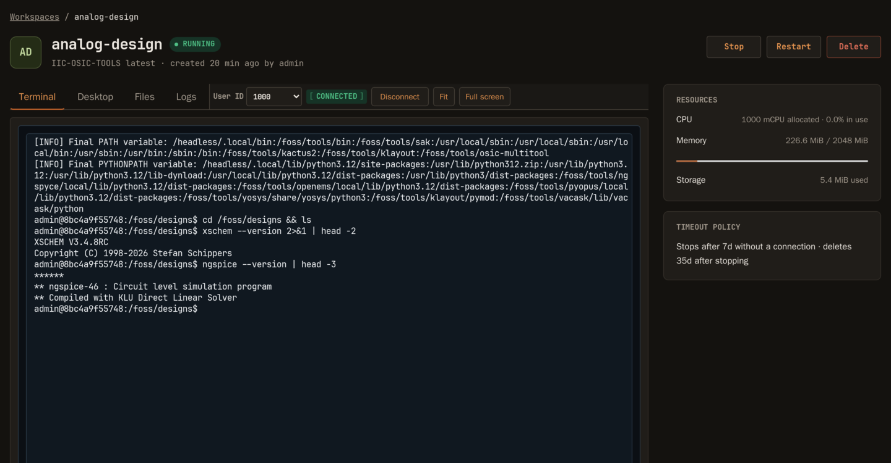
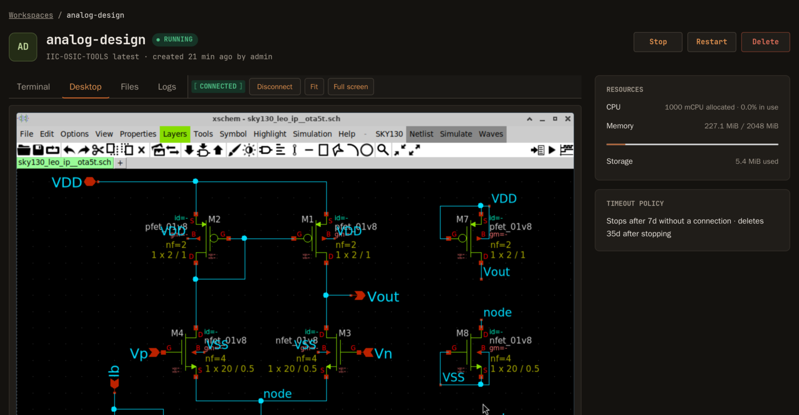

# COWS

**Containerized On-Demand Workspace System** — give your users a preconfigured
software environment in a browser tab, without giving them a shell on your
server.

An administrator defines a *template* (a container image plus resource limits,
mounts, and which access methods are allowed). Users launch their own
*workspaces* from those templates and reach them through one authenticated
HTTPS endpoint: a terminal, a graphical desktop, and a restricted file manager.
COWS runs the containers on **rootless Podman**, enforces per-user quotas and
host capacity, and stops or deletes idle workspaces on a schedule.

It is built for universities, research institutes, and similar teams: one Go
binary, one SQLite database, one server.

> [!WARNING]
> **Not production-ready.** COWS is under active development and is currently
> 100% vibe-coded. Review, testing, and security validation are required before
> production use. Do not expose it to untrusted users or the public internet
> yet — see [SECURITY.md](SECURITY.md).

## Screenshots

A workspace running the [IIC-OSIC-TOOLS](https://github.com/iic-jku/IIC-OSIC-TOOLS)
analog design environment, accessed entirely through the browser.

**Terminal** — an authenticated xterm.js session attached to the container:



**Desktop** — the same workspace over noVNC, running xschem:



## How it works

- **Administrators define templates.** A template pins a container image and
  its resource ranges, mounts, environment, and the access methods (terminal,
  desktop, files, logs) users are allowed to use.
- **Users create workspaces from templates.** They pick a name and, if the
  template permits, CPU and memory within the allowed range.
- **COWS runs them on rootless Podman.** Every workspace is one container. COWS
  stores the desired state, observes the actual runtime state, and reconciles
  the two.
- **Access goes through COWS.** Terminal, desktop, and file traffic is proxied
  through the authenticated endpoint. Workspace VNC, SSH, and application ports
  are never exposed to users directly.
- **Quotas and timeouts keep the host honest.** Per-user and per-group quotas
  plus host-capacity admission gate creation; workspaces that nobody connects
  to are stopped, and stopped workspaces are eventually deleted.

## Quick start

This gets a COWS instance running locally in a few minutes. For a real
deployment, read [docs/deployment.md](docs/deployment.md) instead.

**1. Check the prerequisites.** Linux, Go 1.26 or newer, and a rootless Podman
user socket:

```sh
systemctl --user enable --now podman.socket
systemctl --user status podman.socket
```

Node.js and npm are deliberately not required — all web assets are vendored and
embedded in the binary.

**2. Build:**

```sh
git clone https://github.com/MrHighVoltage/COWS.git
cd COWS
go build -o bin/cows ./cmd/cows
```

**3. Run it with a bootstrap administrator.** These credentials only take
effect on a database with no users:

```sh
COWS_BOOTSTRAP_ADMIN_USERNAME=admin \
COWS_BOOTSTRAP_ADMIN_PASSWORD='choose-a-long-password' \
./bin/cows
```

The server listens on `127.0.0.1:8080` and creates its SQLite database at
`./data/cows.db`.

**4. Confirm it came up.** `/healthz` reports the process and database;
`/readyz` additionally proves COWS reached the live Podman socket:

```sh
curl -s http://127.0.0.1:8080/healthz   # {"status":"ok","database":"ok"}
curl -s http://127.0.0.1:8080/readyz    # {"status":"ok","database":"ok","runtime":"ok"}
```

**5. Create a template and launch a workspace.** Open
<http://127.0.0.1:8080/>, sign in as the bootstrap administrator, then:

- go to **Admin → Templates**, press **Create template**, give it a name and a
  container image, and enable the access methods you want;
- go to **Workspaces**, press **Create workspace**, pick that template, and
  create it;
- press **Start**, then open the workspace to reach its terminal or desktop.

COWS asks the bootstrap administrator to choose a new password on first login.
If the template's image is not present locally, pull it from the template's
page before starting a workspace.

## What works today

Milestone 0 is complete, and milestones 1–5 and 7–9 have working initial
implementations. In short, COWS can currently:

- authenticate local accounts, with self-registration, CSV import, groups,
  quotas, account lifecycle, and password reset by email;
- manage administrator templates with typed runtime configuration, managed
  directory and volume mounts, image availability checks, and explicit pulls;
- run the full workspace lifecycle — create, start, stop, restart, delete —
  with reconciliation, timeout processing, and quota and host-capacity
  admission;
- provide terminal, desktop, restricted file manager, and container log access,
  each gated per template;
- show administrators audit history, live runtime metrics and host capacity,
  and recover retained named volumes and archived directories;
- recover a lost administrator password offline via `cows recover-admin`.

The significant remaining gaps are a tested backup and restore drill,
restart-safe recovery of partial lifecycle operations, rootless-Podman
integration coverage, historical metrics, and deployment hardening. Generic
web-application proxying and other public service exposure are intentionally
out of scope.

[ROADMAP.md](ROADMAP.md) has the complete per-milestone status, and
[docs/implementation/audit-findings.md](docs/implementation/audit-findings.md)
has the latest implementation audit.

## Deployment shape

The supported target is one Linux server running one COWS process, one SQLite
database, and one local rootless Podman runtime, with a reverse proxy
terminating HTTPS. The single-process assumption is intentional: admission
coordination and authentication throttles are process-local, so multiple active
COWS instances are unsupported.

[docs/deployment.md](docs/deployment.md) has the commands and prepared Caddy,
nginx, and Apache proxy examples.

## Development

```sh
tools/web-assets.sh verify   # check vendored web assets
go test ./...
go vet ./...
go build -o bin/cows ./cmd/cows
```

For a local rootless-Podman test instance, keep runtime data in the ignored
`.cows-test/` directory so `go test ./...` never scans mapped container data:

```sh
COWS_DATABASE_PATH=./.cows-test/cows.db \
COWS_MOUNT_ROOT=./.cows-test/cows-mounts \
COWS_MOUNT_ARCHIVE_ROOT=./.cows-test/cows-mounts-archive \
./bin/cows
```

[AGENTS.md](AGENTS.md) documents the working conventions for this repository,
and [ARCHITECTURE.md](ARCHITECTURE.md) explains the package boundaries and the
frontend design system.

## Documentation

| Document | What it covers |
| --- | --- |
| [docs/configuration.md](docs/configuration.md) | Every environment variable and flag, rootless Podman setup, bootstrap credentials, production operation |
| [docs/deployment.md](docs/deployment.md) | Server deployment, reverse-proxy examples, backup, credential recovery |
| [ARCHITECTURE.md](ARCHITECTURE.md) | Package boundaries, runtime adapter, state model, frontend design system |
| [PROJECT.md](PROJECT.md) | Scope, goals, and non-goals |
| [ROADMAP.md](ROADMAP.md) | Per-milestone implementation status |
| [SECURITY.md](SECURITY.md) | Security model and reporting |
| [docs/decisions/](docs/decisions/) | Numbered decision records for every significant design choice |

## Security

COWS is an early development project. Do not expose it to untrusted users or
the public internet until the applicable authentication, authorization,
runtime-isolation, HTTPS, audit, and operational controls are implemented and
reviewed. See [SECURITY.md](SECURITY.md).

## License

COWS is licensed under the **GNU Affero General Public License, version 3 or
any later version**. See [LICENSE](LICENSE).

Commercial use, hosted services, and selling services built with COWS are
allowed. The AGPL copyleft and network-source requirements apply to modified
versions that are conveyed or offered for remote network interaction. COWS
project contributions are intended to remain under the AGPL.
